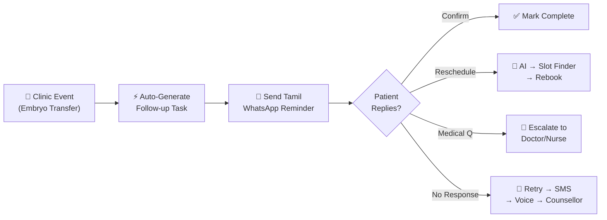
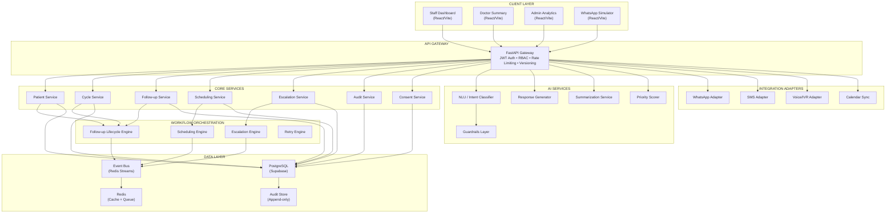
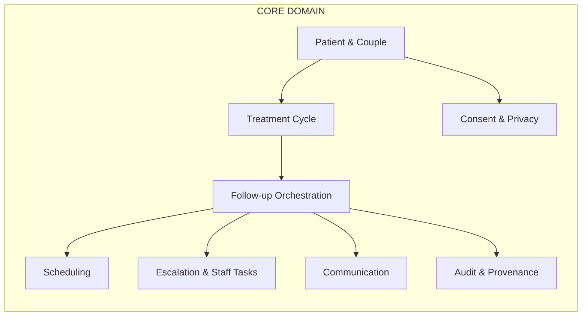
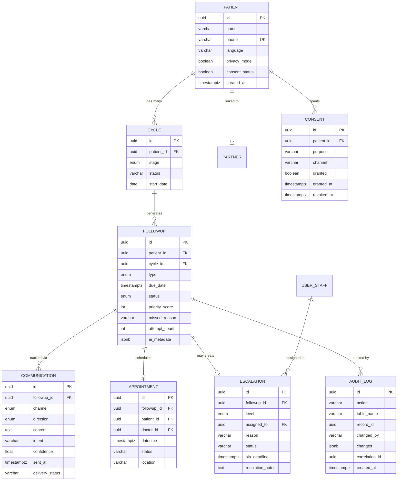
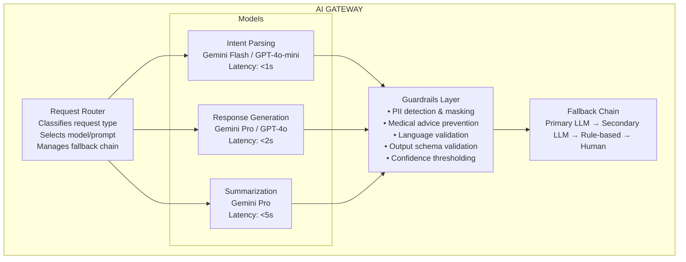
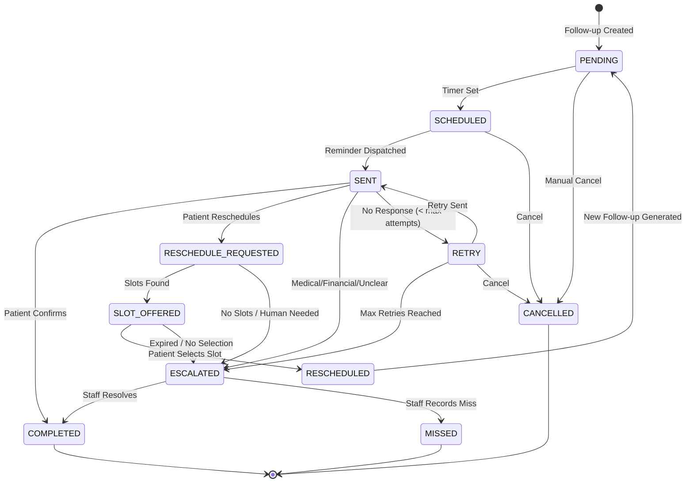
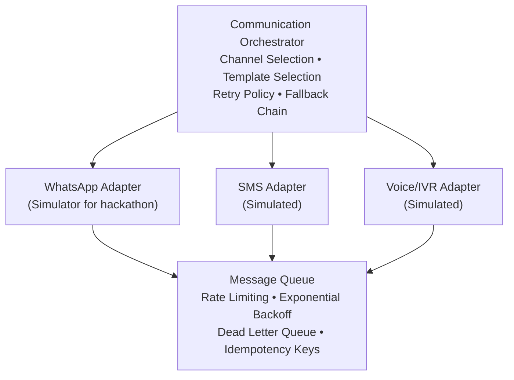
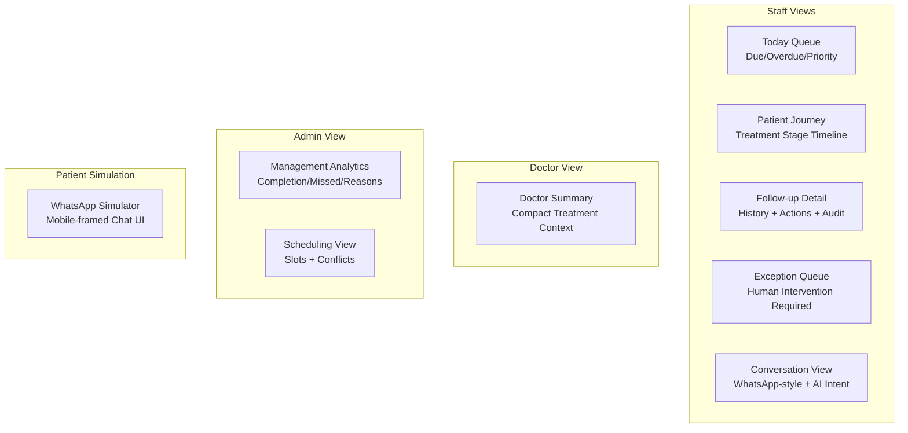

# 🏥 FertiFlow AI — Complete Architecture & Build Plan

> **AI-Powered Fertility Patient Follow-up Orchestration System**
> Hackathon: Problem 1 — Patient Follow-up Management | Extension: Problem 5 — Routine Information Management

---

## 📋 Table of Contents

1. [Executive Summary](#1-executive-summary)
2. [Problem We're Solving](#2-problem-were-solving)
3. [Architectural Principles](#3-architectural-principles)
4. [System Architecture Overview](#4-system-architecture-overview)
5. [Technology Stack](#5-technology-stack)
6. [Module Decomposition](#6-module-decomposition)
7. [Data Architecture](#7-data-architecture)
8. [AI Architecture](#8-ai-architecture)
9. [Workflow Engine Design](#9-workflow-engine-design)
10. [Communication Layer](#10-communication-layer)
11. [Scheduling Engine](#11-scheduling-engine)
12. [Escalation Engine](#12-escalation-engine)
13. [Security & Privacy](#13-security--privacy)
14. [Frontend Architecture](#14-frontend-architecture)
15. [API Surface](#15-api-surface)
16. [Deployment Strategy](#16-deployment-strategy)
17. [Full Build Plan (Sprint-by-Sprint)](#17-full-build-plan)
18. [Project Directory Structure](#18-project-directory-structure)
19. [Demo Script](#19-demo-script)
20. [Definition of Done](#20-definition-of-done)

---

## 1. Executive Summary

FertiFlow AI transforms fertility clinics from reactive, manual follow-up workflows into a **proactive, event-driven orchestration platform**. The system:

- **Auto-generates** follow-ups based on treatment stage events (Baseline → Stimulation → Trigger → OPU → Embryo Transfer → Beta-hCG)
- **Communicates** in Tamil/English via simulated WhatsApp channels
- **Uses AI** (sandboxed) to parse natural-language patient replies into structured intents
- **Handles** routine scheduling autonomously
- **Escalates** medical, financial, and unclear cases to a human Exception Queue
- **Captures** operational analytics on *why* patients miss follow-ups



---

## 2. Problem We're Solving

### Visible Problem
Patients miss critical follow-ups during fertility treatment cycles.

### Root Cause
**Continuity-of-care workflow fragmentation** — patient, coordinator, nurse, doctor, lab, billing, and follow-up state are not connected in one operational workflow.

| Level | Current Pain | FertiFlow Solution |
|-------|-------------|-------------------|
| **Patient** | Forgetting, travel, cost, language barriers, privacy concerns | Multilingual reminders, easy reschedule, privacy-safe messages |
| **Frontline Staff** | Manual calls, scattered Excel/WhatsApp, duplicate contact | Unified follow-up queue, automated reminders, task ownership |
| **Mid-Level Ops** | No stage-aware tasks, weak handoffs, no exception queue | Event-driven journey model, durable workflows, staff escalation |
| **Management** | No visibility into *why* patients drop out | Analytics dashboard with reason categorization |

---

## 3. Architectural Principles

> [!IMPORTANT]
> These 7 principles are **non-negotiable**. Every design decision must satisfy them.

| # | Principle | What It Means |
|---|-----------|---------------|
| 1 | **Human-in-the-loop by default** | AI proposes; humans approve for anything clinical. Automated actions limited to admin coordination. |
| 2 | **Auditability is a feature, not a log** | Every state change writes an immutable event. Audit trail is queryable and visible in the UI. |
| 3 | **Channel-agnostic core** | The engine doesn't know if it's talking via WhatsApp, SMS, or voice. Channel adapters translate. |
| 4 | **Stage-aware, not date-aware** | Follow-ups derive from treatment events, not manual date entry. |
| 5 | **Graceful degradation** | LLM down → templated reminders. WhatsApp down → SMS. No single point of failure. |
| 6 | **Privacy by design** | No sensitive data in notifications. Consent is granular and revocable. |
| 7 | **Idempotent operations** | Retries don't create duplicate follow-ups or double-send messages. |

---

## 4. System Architecture Overview



### Architectural Style
- **Hackathon**: Modular Monolith with background workers (single Docker Compose)
- **Production**: Domain boundaries designed for future microservice extraction

---

## 5. Technology Stack

| Layer | Technology | Justification |
|-------|-----------|---------------|
| **Frontend** | React + Vite + Tailwind CSS | Fast build, modern DX, excellent component ecosystem |
| **Backend** | Python FastAPI | Async, Pydantic validation, auto OpenAPI docs |
| **Database** | PostgreSQL (via Supabase) | JSONB for AI metadata, strong relational integrity, free tier |
| **Cache/Queue** | Redis | Follow-up queues, session cache, event bus (Redis Streams) |
| **AI/LLM** | Gemini API (or GPT-4o-mini / Ollama local) | Structured output, multilingual Tamil support |
| **Scheduler** | APScheduler (or Celery Beat) | Background job scheduling for reminders/retries |
| **Auth** | JWT + RBAC middleware | Role-based access without external dependency |
| **Deployment** | Docker Compose | Single-command local setup for hackathon |
| **Object Storage** | MinIO / Local FS | Documents, audio recordings (future) |

---

## 6. Module Decomposition

### 6.1 Core Domain Services



| Module | Responsibility | Key Operations |
|--------|---------------|----------------|
| **Patient Service** | Patient/couple records, demographics, consent | `create_patient`, `get_patient`, `update_consent`, `link_partner` |
| **Cycle Service** | Track treatment cycles and stages | `start_cycle`, `advance_stage`, `get_current_stage`, `close_cycle` |
| **Follow-up Service** | Generate, track, and resolve follow-ups | `create_followup`, `get_due`, `mark_complete`, `record_reason` |
| **Scheduling Service** | Appointments and slot availability | `find_slots`, `book_appointment`, `reschedule`, `cancel` |
| **Escalation Service** | Route unresolved cases to staff | `create_escalation`, `assign_to_staff`, `resolve_escalation` |
| **Communication Service** | Channel abstraction, templates, delivery | `send_message`, `process_inbound`, `check_delivery` |
| **Consent Service** | Granular consent per channel/purpose | `grant_consent`, `revoke_consent`, `check_consent` |
| **Audit Service** | Immutable event log | `record_event`, `query_events`, `get_patient_timeline` |

### 6.2 AI Services

| Module | Responsibility | Guardrail |
|--------|---------------|-----------|
| **NLU / Intent Classifier** | Parse Tamil/English patient replies → structured intent | Structured schema + confidence + allowed-intent list |
| **Response Generator** | Draft patient-appropriate messages | Templated + LLM polish; no clinical advice |
| **Summarization Service** | Staff/doctor context summaries | Minimum necessary data; no clinical inference |
| **Priority Scorer** | Rank follow-ups by urgency | Rule-based + stage-aware scoring |

### 6.3 Integration Adapters

| Adapter | Hackathon Approach | Production Path |
|---------|-------------------|-----------------|
| **WhatsApp** | Web simulator with realistic UI | WhatsApp Business API |
| **SMS** | Simulated in UI | Twilio/MSG91 |
| **Voice/IVR** | Simulated button | Twilio Voice |
| **Calendar** | Internal DB slots | Google/Outlook sync |

---

## 7. Data Architecture

### 7.1 Entity Relationship Diagram



### 7.2 Database Schema (PostgreSQL)

```sql
-- Enums for strict state flow
CREATE TYPE cycle_stage AS ENUM (
    'enquiry', 'consultation', 'investigation', 'diagnosis',
    'treatment_decision', 'iui_prep', 'ivf_stimulation',
    'egg_retrieval', 'embryo_transfer', 'post_transfer',
    'beta_hcg', 'outcome'
);

CREATE TYPE followup_status AS ENUM (
    'pending', 'scheduled', 'sent', 'retry',
    'reschedule_requested', 'slot_offered', 'rescheduled',
    'escalated', 'completed', 'missed', 'cancelled'
);

CREATE TYPE followup_type AS ENUM (
    'appointment', 'investigation', 'medication',
    'procedure_prep', 'pregnancy_test', 'financial',
    'support', 'counselling'
);

CREATE TYPE escalation_level AS ENUM ('L1', 'L2', 'L3');

-- Patient Core
CREATE TABLE patients (
    id UUID PRIMARY KEY DEFAULT gen_random_uuid(),
    name VARCHAR(255) NOT NULL,
    phone VARCHAR(20) UNIQUE NOT NULL,
    language VARCHAR(10) DEFAULT 'ta',
    district VARCHAR(100),
    privacy_mode BOOLEAN DEFAULT TRUE,
    consent_status BOOLEAN DEFAULT TRUE,
    preferred_channel VARCHAR(20) DEFAULT 'whatsapp',
    preferred_contact_time VARCHAR(20) DEFAULT 'morning',
    created_at TIMESTAMPTZ DEFAULT NOW(),
    updated_at TIMESTAMPTZ DEFAULT NOW()
);

-- Partner / Couple Linking
CREATE TABLE partners (
    id UUID PRIMARY KEY DEFAULT gen_random_uuid(),
    patient_id UUID REFERENCES patients(id) ON DELETE CASCADE,
    name VARCHAR(255),
    phone VARCHAR(20),
    consent_status BOOLEAN DEFAULT TRUE,
    created_at TIMESTAMPTZ DEFAULT NOW()
);

-- Staff / Users
CREATE TABLE users (
    id UUID PRIMARY KEY DEFAULT gen_random_uuid(),
    name VARCHAR(255) NOT NULL,
    email VARCHAR(255) UNIQUE NOT NULL,
    role VARCHAR(50) NOT NULL, -- front_desk, coordinator, nurse, doctor, counsellor, admin
    password_hash VARCHAR(255) NOT NULL,
    created_at TIMESTAMPTZ DEFAULT NOW()
);

-- Clinical Context
CREATE TABLE cycles (
    id UUID PRIMARY KEY DEFAULT gen_random_uuid(),
    patient_id UUID REFERENCES patients(id) ON DELETE CASCADE,
    stage cycle_stage NOT NULL DEFAULT 'enquiry',
    protocol VARCHAR(100), -- IUI, IVF, FET, etc.
    status VARCHAR(50) DEFAULT 'active',
    start_date DATE DEFAULT CURRENT_DATE,
    created_at TIMESTAMPTZ DEFAULT NOW()
);

-- Follow-up Orchestration Engine
CREATE TABLE followups (
    id UUID PRIMARY KEY DEFAULT gen_random_uuid(),
    patient_id UUID REFERENCES patients(id),
    cycle_id UUID REFERENCES cycles(id),
    type followup_type NOT NULL,
    due_date TIMESTAMPTZ NOT NULL,
    status followup_status DEFAULT 'pending',
    priority_score INT DEFAULT 0,
    attempt_count INT DEFAULT 0,
    max_attempts INT DEFAULT 3,
    missed_reason VARCHAR(255),
    assigned_to UUID REFERENCES users(id),
    idempotency_key VARCHAR(255) UNIQUE,
    ai_metadata JSONB,
    created_at TIMESTAMPTZ DEFAULT NOW(),
    updated_at TIMESTAMPTZ DEFAULT NOW()
);

-- Appointments
CREATE TABLE appointments (
    id UUID PRIMARY KEY DEFAULT gen_random_uuid(),
    followup_id UUID REFERENCES followups(id),
    patient_id UUID REFERENCES patients(id),
    doctor_id UUID REFERENCES users(id),
    datetime TIMESTAMPTZ NOT NULL,
    duration_min INT DEFAULT 30,
    status VARCHAR(50) DEFAULT 'scheduled',
    location VARCHAR(255),
    created_at TIMESTAMPTZ DEFAULT NOW()
);

-- Communication Log
CREATE TABLE communications (
    id UUID PRIMARY KEY DEFAULT gen_random_uuid(),
    followup_id UUID REFERENCES followups(id),
    channel VARCHAR(20) NOT NULL, -- whatsapp, sms, voice
    direction VARCHAR(10) NOT NULL, -- inbound, outbound
    content TEXT,
    template_id VARCHAR(100),
    language VARCHAR(10) DEFAULT 'ta',
    intent VARCHAR(50),
    confidence FLOAT,
    delivery_status VARCHAR(20) DEFAULT 'pending',
    idempotency_key VARCHAR(255) UNIQUE,
    sent_at TIMESTAMPTZ DEFAULT NOW()
);

-- Escalation Tracking
CREATE TABLE escalations (
    id UUID PRIMARY KEY DEFAULT gen_random_uuid(),
    followup_id UUID REFERENCES followups(id),
    level escalation_level NOT NULL,
    assigned_to UUID REFERENCES users(id),
    reason VARCHAR(255) NOT NULL,
    status VARCHAR(50) DEFAULT 'created',
    sla_deadline TIMESTAMPTZ,
    resolution_notes TEXT,
    created_at TIMESTAMPTZ DEFAULT NOW(),
    resolved_at TIMESTAMPTZ
);

-- Consent Management
CREATE TABLE consents (
    id UUID PRIMARY KEY DEFAULT gen_random_uuid(),
    patient_id UUID REFERENCES patients(id),
    purpose VARCHAR(50) NOT NULL, -- reminder, marketing, research
    channel VARCHAR(20) NOT NULL, -- whatsapp, sms, voice, all
    granted BOOLEAN DEFAULT TRUE,
    granted_at TIMESTAMPTZ DEFAULT NOW(),
    revoked_at TIMESTAMPTZ
);

-- Immutable Audit Log
CREATE TABLE audit_logs (
    id UUID PRIMARY KEY DEFAULT gen_random_uuid(),
    action VARCHAR(100) NOT NULL,
    table_name VARCHAR(50) NOT NULL,
    record_id UUID NOT NULL,
    changed_by VARCHAR(100),
    user_role VARCHAR(50),
    previous_value JSONB,
    new_value JSONB,
    correlation_id UUID,
    ip_address VARCHAR(50),
    created_at TIMESTAMPTZ DEFAULT NOW()
);

-- Performance Indexes
CREATE INDEX idx_followups_due_status ON followups(due_date, status)
    WHERE status IN ('pending', 'scheduled', 'sent', 'retry');
CREATE INDEX idx_patients_phone ON patients(phone);
CREATE INDEX idx_audit_record_time ON audit_logs(record_id, created_at DESC);
CREATE INDEX idx_escalations_status ON escalations(status, sla_deadline)
    WHERE status IN ('created', 'assigned');
CREATE INDEX idx_communications_followup ON communications(followup_id, sent_at DESC);
```

---

## 8. AI Architecture

### 8.1 Critical Design Decision

> [!CAUTION]
> **The LLM is an INTERPRETER, not a CONTROLLER.**
> ```
> ❌ WRONG: Patient message → LLM → LLM decides action → database mutation
> ✅ RIGHT: Patient message → LLM → structured intent → validation → business service → audit
> ```

### 8.2 AI Orchestration Layer



### 8.3 Intent Schema (Pydantic)

```python
from pydantic import BaseModel
from typing import Literal, Optional

class PatientIntent(BaseModel):
    intent: Literal[
        "CONFIRM", "RESCHEDULE", "CANCEL",
        "MEDICAL_QUESTION", "FINANCIAL_ISSUE",
        "NEED_HELP", "ESCALATE", "UNCLEAR"
    ]
    preferred_day: Optional[str] = None
    preferred_period: Optional[Literal["MORNING", "AFTERNOON", "EVENING"]] = None
    patient_reason: Optional[str] = None
    confidence_score: float
    language_detected: Literal["ta", "en", "mixed"] = "ta"
```

### 8.4 AI Safety Rules

| Rule | Implementation |
|------|---------------|
| Temperature = 0.0 | Deterministic outputs, no hallucination |
| Structured output only | Pydantic validation on every response |
| Confidence threshold | `< 0.85` → flag for review; `< 0.6` → auto-escalate to staff |
| Forbidden topics | Diagnosis, prognosis, medication changes, treatment advice, success rates |
| PII masking | Phone numbers, emails stripped before LLM call |
| Fallback chain | LLM fail → template-based response → human escalation |

### 8.5 LLM System Prompt

```
You are a Medical Administrative Router for a fertility clinic in Tamil Nadu.
Your ONLY job is to read a patient's message and extract their intent.

CRITICAL RULES:
1. You DO NOT answer medical questions.
2. If a patient mentions pain, bleeding, medication, or emotional distress → "MEDICAL_QUESTION" or "ESCALATE"
3. If a patient asks about costs → "FINANCIAL_ISSUE"
4. If intent is unclear → "ESCALATE"
5. Output ONLY the JSON schema. No extra text.

EXAMPLES:
Message: "நாளைக்கு வர முடியாது. Monday morning வரலாமா?"
→ {"intent": "RESCHEDULE", "preferred_day": "Monday", "preferred_period": "MORNING", "patient_reason": "Cannot come tomorrow", "confidence_score": 0.95, "language_detected": "mixed"}

Message: "வயிறு ரொம்ப வலிக்குது, tablet போடலாமா?"
→ {"intent": "MEDICAL_QUESTION", "preferred_day": null, "preferred_period": null, "patient_reason": "Stomach pain, medication request", "confidence_score": 0.98, "language_detected": "ta"}

Message: "Treatment cost அதிகமா இருக்கு, EMI option இருக்கா?"
→ {"intent": "FINANCIAL_ISSUE", "preferred_day": null, "preferred_period": null, "patient_reason": "Cost concern, EMI query", "confidence_score": 0.94, "language_detected": "mixed"}
```

---

## 9. Workflow Engine Design

### 9.1 Follow-up State Machine



### 9.2 Domain Events

All inter-module communication happens through events:

```
PatientCreated → CoupleLinked → CycleStarted → TreatmentStageChanged
→ FollowUpCreated → FollowUpDue → ReminderScheduled → ReminderSent
→ PatientMessageReceived → PatientIntentDetected
→ AppointmentConfirmed / RescheduleRequested → SlotSelected → AppointmentRescheduled
→ ReminderRetried → EscalationCreated → EscalationResolved
→ FollowUpCompleted / FollowUpMissed → MissedReasonRecorded
```

### 9.3 Stage-to-Follow-up Generation Rules

| Treatment Stage Event | Auto-Generated Follow-up | Due Date | Priority |
|----------------------|-------------------------|----------|----------|
| Consultation completed | Investigation follow-up | +3 days | 60 |
| Scan completed | Doctor review / next scan | +1 day | 70 |
| IUI completed | Pregnancy test follow-up | +14 days | 90 |
| **Embryo Transfer completed** | **Blood test (Beta-hCG)** | **+14 days** | **100** |
| Negative result | Counselling task | +2 days | 80 |
| Appointment rescheduled | Cancel old reminder, create new | Slot-dependent | Inherited |

---

## 10. Communication Layer

### 10.1 Channel Abstraction



### 10.2 Channel Fallback Chain

```
WhatsApp (preferred) → SMS (if consent exists) → Voice Call → Staff Manual Call
```

### 10.3 Message Templates (Tamil)

```
Reminder:
"வணக்கம் {name}. உங்களுக்கு கிளினிக்கில் அடுத்த follow-up {date} உள்ளது.
1 - வருகிறேன்
2 - தேதி மாற்ற வேண்டும்"

Privacy-Safe (lock screen):
"You have a scheduled follow-up at the clinic. Please reply to confirm."
```

---

## 11. Scheduling Engine

### 11.1 Slot Discovery

```python
def find_slots(treatment_stage, provider, date_window,
               preferred_period, partner_required, clinic_rules):
    """
    Returns ranked list of available slots.
    AI only expresses preference; this service makes the decision.
    """
    # 1. Get provider availability in date window
    # 2. Filter by treatment-stage resource requirements
    # 3. Check partner attendance if required
    # 4. Apply clinic rules (hours, breaks, max patients)
    # 5. Rank by patient preference match
    # 6. Return top 3 options
```

### 11.2 Reschedule Transaction (Atomic)

```
1. Lock original follow-up (SELECT FOR UPDATE)
2. Create new appointment
3. Cancel old appointment
4. Update follow-up status → RESCHEDULED
5. Cancel pending reminders
6. Create new reminder chain
7. Write audit event
8. Notify staff queue
```

> [!WARNING]
> Use idempotency keys on every operation so duplicate patient messages or webhook retries cannot create double bookings.

---

## 12. Escalation Engine

### 12.1 Escalation Rules

| Trigger | Level | Assigned To | SLA |
|---------|-------|------------|-----|
| No response after 2 attempts | L1 | Patient Coordinator | 24h |
| No response after 3 attempts | L2 | Counsellor | 48h |
| Financial concern detected | L2 | Counsellor + Admin | 24h |
| Medical question detected | L3 | Nurse → Doctor | 4h |
| Emotional distress signal | L2 | Counsellor | 4h |
| Low AI confidence (< 0.6) | L1 | Patient Coordinator | 12h |
| Invalid phone number | L1 | Front Desk | 24h |
| Cancellation request | L2 | Counsellor | 24h |

### 12.2 Missed Reason Categories

| Category | Example |
|----------|---------|
| Forgot | Patient forgot date/time |
| Work/Leave | Couldn't get leave |
| Travel | Distance/transport issue |
| Cost | Treatment cost concern |
| Privacy | Couldn't respond safely |
| Partner | Waiting for spouse |
| Unclear Instructions | Didn't understand next step |
| Failed-cycle Disengagement | Emotional avoidance |
| Phone/Network | Wrong number, network issue |

---

## 13. Security & Privacy

### 13.1 Role-Based Access Control

| Role | Patient Data | Clinical | Communication | Analytics | Admin |
|------|-------------|----------|---------------|-----------|-------|
| Front Desk | Read basic | No | Send templates | No | No |
| Coordinator | Read/Write | Read stage | Full | Read own | No |
| Nurse | Read/Write | Read/Write | Full | Read own | No |
| Doctor | Read/Write | Read/Write | Read | Read own | No |
| Counsellor | Read/Write | Read | Full | Read own | No |
| Admin | Read | Read | Read | Full | Full |

### 13.2 Privacy Controls

- **Neutral notifications**: "You have a scheduled follow-up" (no fertility terms)
- **PII masking**: Strip phone, email, names before sending to LLM
- **Granular consent**: Per-channel (WhatsApp/SMS/Voice), per-purpose (reminders/marketing)
- **Audit trail**: Append-only, queryable, correlation IDs across all operations
- **Encryption**: TLS in transit, encrypted at rest

---

## 14. Frontend Architecture

### 14.1 Screen Map



### 14.2 Key UI Components

| Component | Purpose | Key Feature |
|-----------|---------|-------------|
| `DashboardLayout` | Main wrapper with sidebar navigation | Dark theme, role-based nav |
| `TodayQueue` | Daily operational list | Color-coded: Yellow=Due, Red=Overdue |
| `ExceptionQueue` | Pinned escalation alerts | Red-highlighted, SLA timers |
| `PatientTimeline` | Treatment journey visualization | Stage progress bar + events |
| `ConversationPanel` | Staff view of patient messages | AI intent overlay, confidence badge |
| `WhatsAppSimulator` | Demo patient interaction | Mobile frame, Tamil text, delivery receipts |
| `AnalyticsDashboard` | Management charts | Pie/bar charts for reasons, trends |
| `AuditTrail` | Immutable event log per patient | Chronological, expandable details |

---

## 15. API Surface

### 15.1 Core Endpoints

```
# Patient Management
POST   /api/v1/patients                        # Create patient
GET    /api/v1/patients/{id}                    # Get patient details
PATCH  /api/v1/patients/{id}                    # Update patient
POST   /api/v1/patients/{id}/consent            # Grant/revoke consent

# Cycle Management
POST   /api/v1/patients/{id}/cycles             # Start new cycle
POST   /api/v1/cycles/{id}/events               # Log treatment event → triggers follow-up
GET    /api/v1/cycles/{id}                       # Get cycle details

# Follow-up Management
GET    /api/v1/followups/today                   # Today's queue (main staff view)
GET    /api/v1/followups/overdue                 # Overdue queue
GET    /api/v1/followups/{id}                    # Follow-up detail
POST   /api/v1/followups/{id}/trigger            # Manually trigger reminder
POST   /api/v1/followups/{id}/confirm            # Mark confirmed
POST   /api/v1/followups/{id}/reschedule         # Initiate reschedule
POST   /api/v1/followups/{id}/escalate           # Escalate to staff
POST   /api/v1/followups/{id}/reason             # Record missed reason

# Scheduling
GET    /api/v1/appointments/slots                # Find available slots
POST   /api/v1/appointments                      # Book appointment
PATCH  /api/v1/appointments/{id}                 # Reschedule/cancel

# Communication
POST   /api/v1/messages/inbound                  # WhatsApp webhook (patient replies)
GET    /api/v1/messages/{followup_id}            # Message history

# Escalation
GET    /api/v1/escalations                       # List escalations (exception queue)
PATCH  /api/v1/escalations/{id}                  # Resolve escalation

# AI Services
POST   /api/v1/ai/parse-message                  # Parse patient message → intent
POST   /api/v1/ai/summarize                      # Generate staff summary

# Analytics
GET    /api/v1/analytics/dashboard               # Main dashboard metrics
GET    /api/v1/analytics/reasons                  # Missed reason breakdown

# Audit
GET    /api/v1/audit/{resource_id}               # Audit trail for any resource

# Auth
POST   /api/v1/auth/login                        # Login → JWT token
GET    /api/v1/auth/me                            # Current user info
```

---

## 16. Deployment Strategy

### 16.1 Hackathon Deployment (Docker Compose)

```yaml
# docker-compose.yml
services:
  frontend:
    build: ./frontend
    ports: ["3000:3000"]
    
  backend:
    build: ./backend
    ports: ["8000:8000"]
    depends_on: [db, redis]
    environment:
      - DATABASE_URL=postgresql://...
      - REDIS_URL=redis://redis:6379
      - LLM_API_KEY=${LLM_API_KEY}

  worker:
    build: ./backend
    command: python -m app.worker
    depends_on: [db, redis]

  db:
    image: postgres:16
    volumes: [pgdata:/var/lib/postgresql/data]
    
  redis:
    image: redis:7-alpine
    
volumes:
  pgdata:
```

### 16.2 Production Evolution Path

| Phase | Change |
|-------|--------|
| Phase 2 | Real WhatsApp API, managed DB, Temporal workflows |
| Phase 3 | FHIR API boundary, EMR integration, Kubernetes |
| Phase 4 | Problem 5 (Routine Info), multi-clinic tenant support |
| Phase 5 | Predictive analytics, ABDM integration |

---

## 17. Full Build Plan

> [!TIP]
> This plan is organized into **6 sprints** (each ~4-6 hours of focused work). For a hackathon, sprints 1-4 are **critical path**. Sprints 5-6 are polish.

### Sprint 1: Foundation (Hours 0–6)
**Goal**: Database + Backend scaffold + Basic React shell

| # | Task | Files to Create | Est. Time |
|---|------|----------------|-----------|
| 1.1 | Initialize backend project (FastAPI + Poetry/pip) | `backend/`, `requirements.txt`, `app/main.py` | 30 min |
| 1.2 | Set up PostgreSQL schema + migrations | `app/db/`, `app/models/`, `alembic/` | 1 hr |
| 1.3 | Patient CRUD API | `app/routers/patients.py`, `app/schemas/patient.py` | 1 hr |
| 1.4 | Cycle management API | `app/routers/cycles.py`, `app/schemas/cycle.py` | 45 min |
| 1.5 | Auth middleware (JWT + RBAC) | `app/auth/`, `app/middleware/` | 45 min |
| 1.6 | Initialize React frontend (Vite + Tailwind) | `frontend/`, `src/App.jsx`, `src/index.css` | 30 min |
| 1.7 | Dashboard layout shell + routing | `src/layouts/`, `src/pages/` | 1 hr |
| 1.8 | Seed script with 5 dummy Tamil Nadu patients | `app/db/seed.py` | 30 min |

### Sprint 2: Core Engine (Hours 6–12)
**Goal**: Follow-up generation + Priority queue + Audit trail

| # | Task | Files | Est. Time |
|---|------|-------|-----------|
| 2.1 | Follow-up service (create, list due/overdue) | `app/services/followup.py`, `app/routers/followups.py` | 1.5 hr |
| 2.2 | Stage → Follow-up generation rules | `app/services/stage_rules.py` | 1 hr |
| 2.3 | Priority scoring engine | `app/services/priority.py` | 45 min |
| 2.4 | Audit service (append-only logging) | `app/services/audit.py` | 45 min |
| 2.5 | Background scheduler (APScheduler) | `app/worker.py`, `app/scheduler/` | 1 hr |
| 2.6 | Today Queue UI component | `src/pages/TodayQueue.jsx` | 1 hr |

### Sprint 3: Communication + AI (Hours 12–18)
**Goal**: WhatsApp simulator + AI intent parsing + Response generation

| # | Task | Files | Est. Time |
|---|------|-------|-----------|
| 3.1 | WhatsApp Simulator UI (mobile frame) | `src/components/WhatsAppSimulator.jsx` | 1.5 hr |
| 3.2 | Communication service (send/receive abstraction) | `app/services/communication.py` | 1 hr |
| 3.3 | AI Intent Engine (LLM + Pydantic validation) | `app/services/ai_engine.py` | 1.5 hr |
| 3.4 | Tamil/English message templates | `app/templates/messages.py` | 30 min |
| 3.5 | Webhook handler (inbound patient messages) | `app/routers/webhooks.py` | 45 min |
| 3.6 | Intent → Action routing (state machine) | `app/services/workflow_router.py` | 45 min |

### Sprint 4: Scheduling + Rescheduling (Hours 18–24)
**Goal**: Slot discovery + Atomic reschedule + Calendar update

| # | Task | Files | Est. Time |
|---|------|-------|-----------|
| 4.1 | Scheduling service (slot discovery) | `app/services/scheduling.py` | 1 hr |
| 4.2 | Appointment booking API | `app/routers/appointments.py` | 45 min |
| 4.3 | Atomic reschedule transaction | `app/services/reschedule.py` | 1 hr |
| 4.4 | Reminder cancellation/recreation | `app/services/reminders.py` | 45 min |
| 4.5 | Scheduling UI (slot picker) | `src/components/SlotPicker.jsx` | 1 hr |
| 4.6 | Patient journey timeline UI | `src/components/PatientTimeline.jsx` | 1.5 hr |

### Sprint 5: Escalation + Analytics (Hours 24–30)
**Goal**: Exception queue + Reason capture + Management dashboard

| # | Task | Files | Est. Time |
|---|------|-------|-----------|
| 5.1 | Escalation engine (rules + SLA) | `app/services/escalation.py` | 1 hr |
| 5.2 | Exception Queue UI | `src/pages/ExceptionQueue.jsx` | 1 hr |
| 5.3 | Retry engine (non-response handling) | `app/services/retry_engine.py` | 45 min |
| 5.4 | Missed reason capture + API | `app/routers/reasons.py` | 30 min |
| 5.5 | Analytics API (dashboard metrics) | `app/routers/analytics.py` | 1 hr |
| 5.6 | Analytics Dashboard UI (charts) | `src/pages/Analytics.jsx` | 1.5 hr |

### Sprint 6: Polish + Demo (Hours 30–36)
**Goal**: Doctor summary view + Demo hardening + Edge cases

| # | Task | Files | Est. Time |
|---|------|-------|-----------|
| 6.1 | Doctor summary view UI | `src/pages/DoctorSummary.jsx` | 1 hr |
| 6.2 | Audit trail slide-out panel | `src/components/AuditTrail.jsx` | 1 hr |
| 6.3 | Consent management UI | `src/components/ConsentPanel.jsx` | 45 min |
| 6.4 | Privacy-safe notification demo | Templates + UI verification | 30 min |
| 6.5 | Seed 5 realistic demo patients | `app/db/demo_seed.py` | 30 min |
| 6.6 | Demo script rehearsal | End-to-end walkthrough | 1.5 hr |
| 6.7 | Edge case testing (duplicates, failures) | Test scenarios | 1 hr |

---

## 18. Project Directory Structure

```
FertiFlow/
├── docker-compose.yml
├── .env.example
├── README.md
│
├── backend/
│   ├── Dockerfile
│   ├── requirements.txt
│   ├── alembic/                    # DB migrations
│   │   └── versions/
│   ├── app/
│   │   ├── __init__.py
│   │   ├── main.py                 # FastAPI entry point
│   │   ├── config.py               # Settings / env vars
│   │   ├── worker.py               # Background task runner
│   │   │
│   │   ├── auth/
│   │   │   ├── jwt_handler.py      # JWT token management
│   │   │   ├── rbac.py             # Role-based access control
│   │   │   └── dependencies.py     # Auth dependencies
│   │   │
│   │   ├── db/
│   │   │   ├── database.py         # DB connection + session
│   │   │   ├── seed.py             # Dummy data seeder
│   │   │   └── demo_seed.py        # Demo-specific seed
│   │   │
│   │   ├── models/                 # SQLAlchemy models
│   │   │   ├── patient.py
│   │   │   ├── cycle.py
│   │   │   ├── followup.py
│   │   │   ├── appointment.py
│   │   │   ├── communication.py
│   │   │   ├── escalation.py
│   │   │   ├── consent.py
│   │   │   ├── audit.py
│   │   │   └── user.py
│   │   │
│   │   ├── schemas/                # Pydantic schemas
│   │   │   ├── patient.py
│   │   │   ├── cycle.py
│   │   │   ├── followup.py
│   │   │   ├── appointment.py
│   │   │   ├── ai_intent.py
│   │   │   └── analytics.py
│   │   │
│   │   ├── routers/                # API endpoints
│   │   │   ├── patients.py
│   │   │   ├── cycles.py
│   │   │   ├── followups.py
│   │   │   ├── appointments.py
│   │   │   ├── webhooks.py
│   │   │   ├── escalations.py
│   │   │   ├── analytics.py
│   │   │   ├── ai_service.py
│   │   │   ├── audit.py
│   │   │   └── auth.py
│   │   │
│   │   ├── services/               # Business logic
│   │   │   ├── followup.py
│   │   │   ├── stage_rules.py      # Stage → follow-up generation
│   │   │   ├── priority.py         # Priority scoring
│   │   │   ├── scheduling.py       # Slot discovery + booking
│   │   │   ├── reschedule.py       # Atomic reschedule
│   │   │   ├── communication.py    # Channel orchestration
│   │   │   ├── ai_engine.py        # LLM + intent parsing
│   │   │   ├── escalation.py       # Escalation rules
│   │   │   ├── retry_engine.py     # Non-response handling
│   │   │   ├── audit.py            # Immutable audit logging
│   │   │   ├── reminders.py        # Reminder scheduling
│   │   │   └── workflow_router.py  # Intent → action routing
│   │   │
│   │   ├── templates/              # Message templates
│   │   │   └── messages.py         # Tamil/English templates
│   │   │
│   │   └── scheduler/              # Background jobs
│   │       ├── jobs.py             # Scheduled tasks
│   │       └── config.py           # Scheduler config
│   │
│   └── tests/
│       ├── test_followups.py
│       ├── test_ai_engine.py
│       └── test_scheduling.py
│
├── frontend/
│   ├── Dockerfile
│   ├── package.json
│   ├── vite.config.js
│   ├── tailwind.config.js
│   ├── index.html
│   │
│   └── src/
│       ├── main.jsx
│       ├── App.jsx
│       ├── index.css              # Design system / tokens
│       │
│       ├── api/                   # API client
│       │   └── client.js
│       │
│       ├── layouts/
│       │   └── DashboardLayout.jsx
│       │
│       ├── pages/
│       │   ├── TodayQueue.jsx     # Main staff view
│       │   ├── ExceptionQueue.jsx # Escalations
│       │   ├── Analytics.jsx      # Management dashboard
│       │   ├── DoctorSummary.jsx  # Doctor compact view
│       │   └── Login.jsx
│       │
│       ├── components/
│       │   ├── WhatsAppSimulator.jsx
│       │   ├── PatientTimeline.jsx
│       │   ├── AuditTrail.jsx
│       │   ├── SlotPicker.jsx
│       │   ├── ConsentPanel.jsx
│       │   ├── ConversationPanel.jsx
│       │   ├── FollowupCard.jsx
│       │   ├── EscalationCard.jsx
│       │   ├── PriorityBadge.jsx
│       │   └── StatsCard.jsx
│       │
│       └── hooks/
│           ├── useFollowups.js
│           ├── useAuth.js
│           └── useWebSocket.js
│
└── docs/
    ├── architecture.md
    ├── api-reference.md
    └── demo-script.md
```

---

## 19. Demo Script

### Split-Screen Layout
**Left**: React Staff Dashboard → **Right**: WhatsApp Simulator

### Act 1: Automated Trigger (60 seconds)
1. Present patient **"Madhan"** from Tirunelveli who just completed an **Embryo Transfer**
2. Staff clicks "Log Event: Embryo Transfer Complete"
3. System instantly generates a **Beta-hCG test follow-up** (due in 14 days, priority: 100)
4. Tamil WhatsApp message appears in Simulator:
   > "வணக்கம் Madhan. உங்களுக்கு கிளினிக்கில் அடுத்த follow-up Oct 22 உள்ளது. 1 - வருகிறேன், 2 - தேதி மாற்ற வேண்டும்"

### Act 2: AI-Powered Reschedule (90 seconds)
1. As Madhan, type in simulator: **"நாளைக்கு வர முடியாது. Tuesday morning வரலாமா?"**
2. Dashboard instantly updates:
   - AI Intent badge: `RESCHEDULE (confidence: 0.95)`
   - Status: `RESCHEDULE_REQUESTED`
   - Three available Tuesday morning slots appear
3. Select a slot → appointment booked → calendar updated → audit trail shows full chain

### Act 3: Safety Catch (60 seconds)
1. Send reminder to patient **"Lakshmi"**
2. Lakshmi replies: **"Treatment cost அதிகமா இருக்கு, EMI option இருக்கா?"**
3. System **halts automation** — UI flashes **red**
4. Lakshmi appears in **Exception Queue** with:
   - AI classification: `FINANCIAL_ISSUE`
   - Assigned to: Counsellor
   - SLA: 24 hours
5. Open audit trail showing the complete decision chain

### Act 4: Analytics (30 seconds)
1. Open Management Analytics
2. Show pie chart of **why patients miss follow-ups**: Travel (35%), Cost (25%), Forgot (20%), Work (15%), Other (5%)
3. Demonstrate the system extracts actionable BI from unstructured conversations

---

## 20. Definition of Done

- [ ] Every demo patient has a treatment stage and at least one generated follow-up
- [ ] Due follow-ups automatically appear in Today Queue
- [ ] Reminders are generated with selected language and privacy mode
- [ ] Confirm and reschedule replies update workflow state correctly
- [ ] Rescheduling updates appointment and cancels old reminders
- [ ] No-response produces retry and then owned staff escalation
- [ ] Medical/uncertain messages do NOT receive automated clinical advice
- [ ] Missed reason is captured and visible in analytics
- [ ] All important changes produce audit records
- [ ] Duplicate webhook/message tests do NOT create duplicate appointments
- [ ] Demo runs fully with dummy data without external dependencies

---

## What to Build vs. What to Simulate

| Component | Build Real | Simulate | Rationale |
|-----------|:---------:|:--------:|-----------|
| Patient DB + Schema | ✅ | | Core to everything |
| Follow-up Engine | ✅ | | Primary differentiator |
| Scheduling Service | ✅ | | Required for demo |
| AI Intent Parsing | ✅ | | Key AI differentiator |
| Audit Log | ✅ | | Shows compliance thinking |
| Staff Dashboard | ✅ | | Main demo surface |
| WhatsApp Interaction | | ✅ | API approval takes time |
| SMS / Voice | | ✅ | Same |
| Calendar Sync | | ✅ | External dependency |
| Lab Integration | | ✅ | Out of scope |

---

> [!NOTE]
> **Next Steps**: Once you approve this plan, I can start building Sprint 1 immediately — setting up the FastAPI backend, PostgreSQL schema, and React frontend scaffold.
